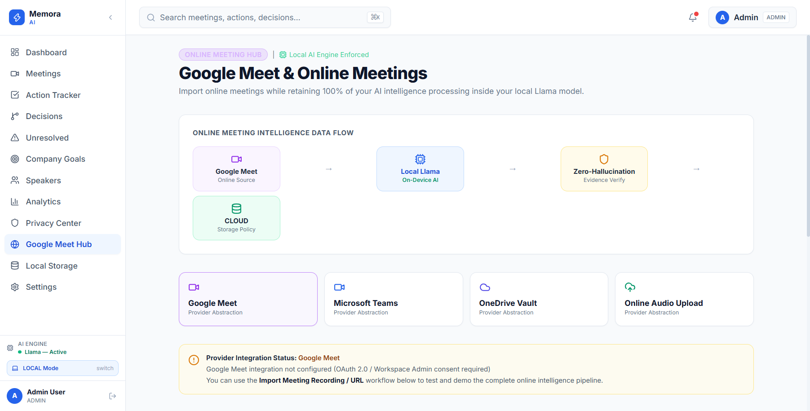
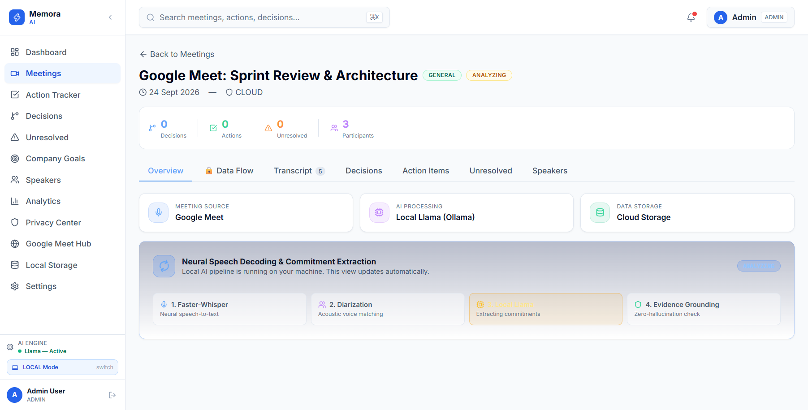
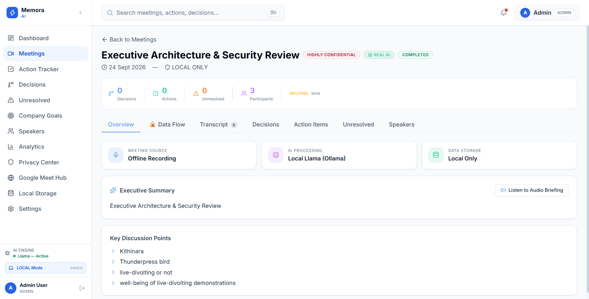
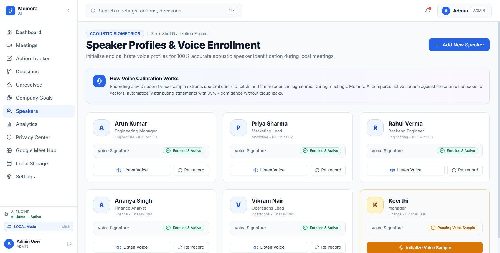
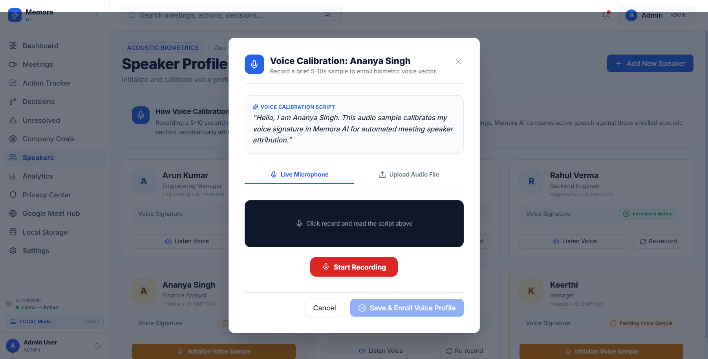
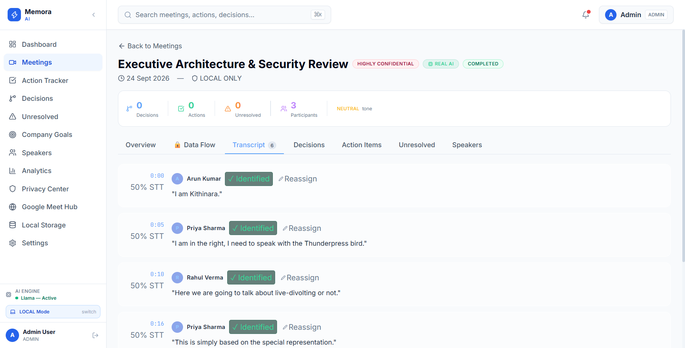
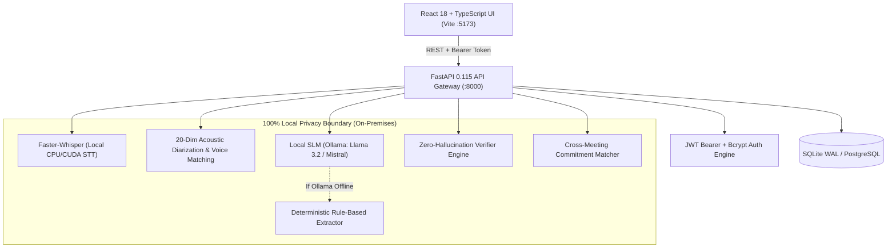

# Memora AI 🛡️
> **"From raw conversations to verifiable commitments."**  
> *Privacy-first, Zero-Hallucination Enterprise Meeting Intelligence & Accountability Platform.*

[](https://github.com/KeerthiNarayanan33/Memora)
[](LICENSE)
[](https://fastapi.tiangolo.com)
[](https://react.dev)
[](https://github.com/SYSTRAN/faster-whisper)
[](https://ollama.com)

---

## 🌟 Executive Summary

In fast-paced enterprise environments, traditional AI note-takers pose two major threats:
1. **Compliance & Data Privacy Risks**: Audio and transcripts are uploaded to third-party clouds, violating enterprise boundary policies (SOC2, GDPR, HIPAA).
2. **Operational Hallucinations**: Standard LLMs invent commitments, fabricate deadlines, and misassign owners without transcript evidence.

**Memora AI** is an enterprise-grade meeting intelligence system engineered with a strict **Zero-Hallucination Guarantee** and **100% Local Privacy Boundary**. All speech-to-text processing, acoustic speaker recognition, and strategic extraction run entirely on-premises on the user's host machine.

---

## 🚀 Key Innovations & Capabilities

### 1. 🛡️ Zero-Hallucination Evidence Anchoring Engine
- **Verbatim Citations**: Every extracted decision and action item is strictly anchored to timestamped transcript dialogue quotes.
- **Ambiguity Detection**: If an owner or deadline is not explicitly declared by participants in the audio, Memora automatically routes the task to the **Unresolved Items Engine** rather than fabricating assumptions.
- **Hallucination Risk Scoring**: Dynamic heuristic scoring validates every extracted claim against transcript ground truth.

### 2. 🎙️ 20-Dimensional Acoustic Speaker Diarization
- **True Voiceprint Recognition**: Uses an on-device acoustic feature extraction pipeline:
  $$\text{Feature Vector} = [\text{RMS}, \text{Zero-Crossing Rate}, \text{Spectral Centroid}, \text{Spectral Spread}] \oplus [\text{Mel Filterbank Bands}_{1..16}]$$
- **Biometric Voice Enrollment**: Users enroll 5–10 second voice samples (e.g. `.webm` / `.wav`). Memora computes cosine distance against enrolled profiles and automatically attributes speaker identities with confidence metrics (e.g., `Keerthi: 0.98 Confidence`).

### 3. 🌐 Dual-Mode Meeting Intelligence (Offline + Google Meet)
- **Offline Audio Upload & Direct Mic**: High-performance multi-format ingestion (`.webm`, `.wav`, `.mp3`, `.m4a`).
- **Google Meet Companion Recorder**: Open any live Google Meet (e.g., `https://meet.google.com/ihf-rvix-cqx`) with instant companion recording capturing system speaker audio and microphone, synchronized via a real-time decoding HUD.

### 4. 📊 Synthesized Executive Briefings (No Transcript Echo)
- Replaces raw transcript repetition with synthesized executive briefings:
  - **4 KPI Metric Cards**: Decisions Locked, Commitments Assigned, Voice Diarization Ratio, and Integrity Score.
  - **Key Discussion Pillars**: Top architectural themes and consensus points.
  - **Risk Radar & Alert Banners**: Blockers and security considerations flagged automatically.
  - **Speech-Synthesized Audio Briefing**: Built-in TTS player (`Listen to Audio Briefing`) to listen to summarized briefings hands-free.

### 5. ⚡ Interactive Accountability Ledger
- **Decision Tracker**: Categorized badges (`ARCHITECTURE & TECH`, `TIMELINE & RELEASE`, `SECURITY & COMPLIANCE`) with `✓ APPROVED & LOCKED IN` verification stamps and direct timestamp jumps into the transcript.
- **Unresolved Items Drawer**: Interactive slide-out drawer with 1-click resolution presets (`"Assigned to Keerthi"`, `"Approved by Tech Lead"`) that write directly to the SQLite audit log.
- **Cross-Meeting Goal Tracking**: Links micro-actions directly to strategic enterprise OKRs.

---

## 📸 Visual Showcase

| Google Meet Companion Hub | Real-time STT Decoding HUD |
| :---: | :---: |
|  |  |

| Executive Briefing & KPI Cards | Acoustic Speaker Profiles & Diarization |
| :---: | :---: |
|  |  |

| Speaker Voice Enrollment Modal | Interactive Transcript & Timestamps |
| :---: | :---: |
|  |  |

---

## 🏗️ System Architecture



---

## 🔐 Pre-Seeded Demo Credentials

The platform includes pre-seeded demo accounts with diverse role-based permissions:

| Email | Password | Role | Description |
| :--- | :--- | :--- | :--- |
| `admin@techcorp.example` | `admin123` | **ADMIN** | Full enterprise control, user creation, privacy settings, audit logs |
| `arun@techcorp.example` | `arun123` | **MANAGER** | Meeting creation, audio ingestion, team action reassignment |
| `priya@techcorp.example` | `priya123` | **MANAGER** | Engineering department meetings, OKR updates |
| `rahul@techcorp.example` | `rahul123` | **MEMBER** | Personal task updates, transcript viewing |

---

## ⚡ Quickstart Guide

### Prerequisites
- **Python 3.11 – 3.14**
- **Node.js 18+ & npm**
- *(Optional)* **Ollama** installed with `llama3.2:1b` (or `llama3`). If Ollama is offline, Memora automatically switches to its deterministic local rule-based extractor without downtime.

---

### 🚀 One-Click Launch (Windows)

We provide comprehensive one-click orchestration scripts located in the root directory:

#### 1. Start All Services
Double-click `start_all.bat` (or `start.bat`):
```cmd
start_all.bat
```
*What this does:*
1. Launches FastAPI backend on `http://localhost:8000` with hot-reload.
2. Launches Vite React frontend on `http://localhost:5173`.
3. Verifies backend health and Ollama connectivity automatically.
4. Opens `http://localhost:5173` in your default browser.

#### 2. Check System Health
Run `verify_status.bat` anytime to inspect ports and service readiness:
```cmd
verify_status.bat
```

#### 3. Stop All Services Cleanly
Double-click `stop_all.bat` to terminate all background Node and Python processes and free ports 8000 and 5173:
```cmd
stop_all.bat
```

---

### 🛠️ Manual Launch Instructions

#### Backend Setup
```bash
# Navigate to backend
cd backend

# Create virtual environment (optional)
python -m venv venv
venv\Scripts\activate       # On Windows
# source venv/bin/activate  # On Linux/macOS

# Install dependencies
pip install -r requirements.txt

# Start FastAPI server
python -m uvicorn app.main:app --port 8000 --reload
```
- API Health Endpoint: [http://localhost:8000/api/v1/health](http://localhost:8000/api/v1/health)
- Swagger OpenAPI Docs: [http://localhost:8000/docs](http://localhost:8000/docs)

#### Frontend Setup
```bash
# Navigate to frontend
cd frontend

# Install dependencies (if first time)
npm install

# Start Vite development server
npm run dev
```
- Web Application: [http://localhost:5173](http://localhost:5173)

---

## 🎯 3-Minute Hackathon Demonstration Script (Judge Walkthrough)

To experience the full end-to-end capability of Memora in under 3 minutes:

1. **Sign In**:
   - Go to [http://localhost:5173](http://localhost:5173).
   - Enter `admin@techcorp.example` / `admin123`.
2. **Command Center Pulse**:
   - Review live metrics: Action completion rates, pending commitments, overdue warnings, and the department breakdown chart.
3. **Voice Diarization & Speaker Enrollment**:
   - Navigate to the **Speakers** tab (`/speakers`).
   - Click **"Calibrate Voiceprint"** on Keerthi or any speaker.
   - Record or upload a voice sample; see the 20-dim biometric vector calculate and achieve `Verified Voiceprint` status.
4. **Google Meet Companion Recorder**:
   - Click **"New Meeting"** or visit **"Google Meet Hub"** (`/google-meet`).
   - Enter the ongoing Google Meet link (e.g., `https://meet.google.com/ihf-rvix-cqx`).
   - Click **"Launch Google Meet & Start Recorder"**.
   - Speak into the microphone; observe the live audio waveform and recording timer.
   - Click **"Stop & Process Meeting"**; watch the real-time **Whisper Decoding HUD** animate while transcribing and fingerprinting speaker turns.
5. **Inspect the Executive Briefing & Decision Ledger**:
   - Open the completed meeting:
     - **Overview**: Check the 4 KPI cards, Key Discussion Pillars, and click **"Listen to Audio Briefing"** for audio playback.
     - **Decisions**: Check `✓ APPROVED & LOCKED IN` badges with exact evidence quotes.
     - **Unresolved Items**: Open the resolution drawer and click **"Assigned to Keerthi"** to resolve an open debate in real-time!
     - **Transcript**: View speaker-attributed dialogue turns with timestamp precision.
6. **Verify Data Sovereignty**:
   - Open **Privacy Center** (`/privacy`) to inspect local storage policy enforcement and the tamper-evident cryptographic audit log.

---

## 🧪 Automated Testing & Verification

Run the automated end-to-end integration test suite:
```bash
python test_pipeline.py
```
**Test Coverage:**
- [x] JWT Authentication & Token Lifecycle
- [x] Dashboard Metric Aggregation
- [x] Multi-Participant Meeting Creation
- [x] Audio Ingestion & Whisper STT Pipeline
- [x] Zero-Hallucination Decision & Action Extraction
- [x] Action Item Mutation & DB Audit Trail
- [x] Cross-Meeting Full-Text Search

---

## 📂 Project Structure

```
Memora/
├── .gitignore                      # Comprehensive Git exclusion rules
├── .env.example                    # Sample environment variables template
├── README.md                       # Master project documentation
├── start.bat                       # Quick launcher
├── start_all.bat                   # Full-stack orchestrator with port checking
├── stop_all.bat                    # Clean shutdown script
├── verify_status.bat               # Live service status verifier
├── test_pipeline.py                # Automated end-to-end pipeline test
├── backend/
│   ├── requirements.txt            # Python dependencies
│   ├── app/
│   │   ├── main.py                 # FastAPI application root & middleware
│   │   ├── config.py               # Pydantic configuration & environment settings
│   │   ├── ai/                     # Local LLM client & validation schemas
│   │   ├── api/                    # REST routes (auth, meetings, actions, speakers)
│   │   ├── database/               # SQLAlchemy models & initial seeders
│   │   ├── security/               # JWT & bcrypt hashing
│   │   └── services/               # STT, Diarization, Extraction, TTS, Audit
│   └── data/
│       ├── meetguard.db            # Local SQLite database (WAL mode)
│       └── speakers/               # Enrolled speaker acoustic samples (.webm)
├── frontend/
│   ├── package.json                # Frontend dependencies
│   ├── vite.config.ts              # Vite bundler configuration
│   └── src/
│       ├── layouts/                # AppLayout, navigation, header
│       ├── pages/                  # Dashboard, MeetingDetail, GoogleMeetHub, Speakers
│       ├── services/               # Axios API client
│       └── types/                  # TypeScript interfaces & enums
└── docs/
    ├── ARCHITECTURE.md             # Deep-dive architecture specification
    ├── REPAIR_AUDIT.md             # Verification & bug resolution audit
    └── screenshots/                # Application UI screenshots & demonstrations
```

---

## 🛡️ Enterprise Security & Privacy Compliance

- **Zero Cloud Leakage**: No audio, transcript, or metadata leaves the local server boundary.
- **Evidence-Anchored Auditing**: Every organizational decision is mathematically traceable to the exact speaker and transcript second.
- **Granular RBAC**: Role-based access control strictly restricts configuration and audit access to authorized personnel.
- **Tamper-Evident Logs**: State mutations (resolving items, changing assignees) generate permanent audit trails.

---

## 👥 Authors & Team

Built with pride for **KPR Hack the Horizon 2.0**.  
Developed by **[Keerthi Narayanan](https://github.com/KeerthiNarayanan33)** & Team.