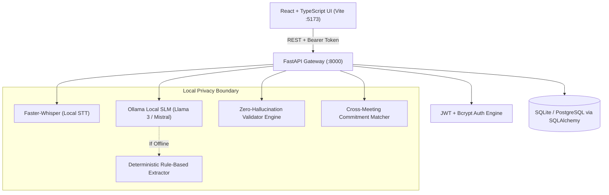

# MeetGuard AI 🛡️
> **"From conversations to commitments."**  
> *Privacy-first, Zero-Hallucination Enterprise Meeting Intelligence & Accountability Platform.*

Built for **KPR Hack the Horizon 2.0 Hackathon**.

---

## 🌟 Executive Summary

In enterprise environments, standard AI transcription tools pose severe compliance risks (data leakage to third-party clouds) and operational failures (phantom commitments, unassigned decisions, lack of evidence-backed auditing).

**MeetGuard AI** transforms raw meeting dialogues into verifiable organizational accountability:
1. **Privacy-First Architecture**: 100% on-premises execution using local SLM/LLM models (Ollama / Llama 3) and local speech-to-text (Whisper). Zero audio or transcript leaves the enterprise boundary.
2. **Zero-Hallucination Guarantee**: Every extracted decision and action item is strictly anchored to verbatim transcript timestamps and speaker quotes with cross-verification heuristics.
3. **Commitment Lifecycle Engine**: Tracks commitments from dialogue inception through execution, cross-meeting follow-ups, and strategic goal alignment.
4. **Resilient Dual-Engine AI Pipeline**: Automatic hardware autodetection with instant fallback to a deterministic local rule-based extractor when GPU/Ollama is offline.

---

## 🏗️ System Architecture



---

## 🚀 Key Features

| Module | Enterprise Capability |
| :--- | :--- |
| **Command Center** | High-level KPI pulse: action completion rates, pending commitments, overdue alerts, department distribution charts, and recent activity streams. |
| **Meeting Intelligence** | Multi-format audio upload (`.mp3`, `.wav`, `.m4a`, `.webm`), automated speaker diarization, sentiment trajectory, and structured extraction. |
| **Action Items & SLA Tracker** | Granular status tracking (`NEW`, `IN_PROGRESS`, `COMPLETED`, `OVERDUE`, `CARRIED_OVER`, `UNRESOLVED`) with inline assignee reassignment and deadline adjustments. |
| **Decision Ledger** | Immutable organizational record of approved decisions with explicit confidence scores and evidence quotes. |
| **Unresolved Topics Engine** | Surfaces tabled debates, ambiguous commitments, and questions left unanswered for automatic follow-up in subsequent agendas. |
| **Goal Alignment (OKRs)** | Links micro-actions directly to strategic enterprise initiatives, calculating dynamic progress percentages. |
| **Privacy & Security Center** | Storage policy management (`LOCAL_ONLY`, `LOCAL_AND_CLOUD`), retention windows, PII redaction settings, and tamper-evident audit logs. |
| **Speaker Profiles** | Voiceprint registration, talk-time analytics, and confidence scores across meeting participants. |
| **Enterprise Search** | Cross-meeting query engine indexing transcripts, decisions, and action items simultaneously. |

---

## 🔐 Demo Credentials

All test accounts are pre-seeded in the database:

| Email | Password | Role | Permissions |
| :--- | :--- | :--- | :--- |
| `admin@techcorp.example` | `admin123` | **ADMIN** | Full enterprise control, user creation, privacy settings, audit logs |
| `arun@techcorp.example` | `arun123` | **MANAGER** | Meeting creation, audio processing, team action reassignment |
| `priya@techcorp.example` | `priya123` | **MANAGER** | Engineering department meetings, OKR updates |
| `rahul@techcorp.example` | `rahul123` | **MEMBER** | Personal task updates, transcript viewing |

---

## ⚡ Quickstart Guide

### Prerequisites
- **Python 3.11 - 3.14**
- **Node.js 18+ & npm**
- *(Optional)* **Ollama** installed with `llama3` model for live local AI extraction. If Ollama is not running, MeetGuard AI automatically switches to high-fidelity deterministic fallback without crashing.

### One-Click Launch (Windows)
Double-click `start.bat` in the root directory:
```bat
start.bat
```
This script launches both the FastAPI backend (`http://localhost:8000`) and the Vite React frontend (`http://localhost:5173`) in concurrent terminal windows.

---

### Manual Launch

#### 1. Backend Service
```bash
cd backend

# Create & activate virtual environment (optional)
python -m venv venv
venv\Scripts\activate

# Install dependencies
pip install -r requirements.txt

# Start backend server
python -m uvicorn app.main:app --reload --port 8000
```
- API Health Check: `http://localhost:8000/api/v1/health`
- Interactive OpenAPI Docs: `http://localhost:8000/docs`

#### 2. Frontend Application
```bash
cd frontend

# Dependencies are already installed
npm run dev
```
- Web Application: `http://localhost:5173`

---

## 🎯 Hackathon Demonstration Script (Judge Walkthrough)

To experience the full capability of MeetGuard AI in under 3 minutes:

1. **Sign In**:
   - Navigate to `http://localhost:5173`
   - Log in with `admin@techcorp.example` / `admin123`.
2. **Review Command Center**:
   - Observe real-time KPI metrics, completion rate percentages, and overdue action alerts seeded from previous meetings.
   - Inspect the department breakdown and interactive activity timeline.
3. **Inspect an Existing Meeting**:
   - Navigate to **Meetings** tab and click on `"Q3 Product Roadmap & Security Architecture"`.
   - Explore the 6 tabs:
     - **Overview**: Executive summary, key points, risks, and sentiment analysis.
     - **Transcript**: Speaker-attributed dialogue with exact timestamps.
     - **Decisions**: Formal decisions with verified evidence quotes.
     - **Action Items**: Assigned tasks with ownership clarity and due dates.
     - **Unresolved**: Flagged open items (e.g., budget allocations pending CTO approval).
     - **Speakers**: Talk-time distribution and participant voice profiles.
4. **Create & Process a New Meeting**:
   - Click **"New Meeting"** in the top navigation or sidebar.
   - Fill in:
     - Title: `Core Platform Microservices Migration Review`
     - Date: Select today's date
     - Classification: `CONFIDENTIAL`
     - Storage Policy: `LOCAL_ONLY`
     - Participants: `Arun Patel, Rahul Sharma, Priya Singh`
   - Click **"Create Meeting"**.
   - On the meeting details page, click **"Run AI Analysis"**.
   - Watch the background processing pipeline transition from `TRANSCRIBING` → `IDENTIFYING_SPEAKERS` → `ANALYZING` → `VALIDATING` → `COMPLETED`.
   - Review the newly generated summary, decisions, and action items!
5. **Manage Accountability & Actions**:
   - Navigate to the **Action Items** page.
   - Filter by status or search for an assignee.
   - Mark an item as `COMPLETED` or update the status; observe instant persistence and dashboard metric updates.
6. **Verify Privacy & Security**:
   - Open **Privacy Center** to verify local storage enforcement, zero external telemetry, and browse the immutable audit trail of all platform activities.

---

## 🧪 Verification & Automated Testing

Run the included automated end-to-end integration test:
```bash
python test_pipeline.py
```
This tests:
- Authentication & JWT issuance
- Dashboard metric aggregation
- Meeting creation & background extraction pipeline
- Decision & action item extraction with evidence anchoring
- Action status mutation & audit logging
- Cross-meeting full-text search

---

## 🛡️ Zero-Hallucination & Privacy Commitments

- **No Remote Leakage**: All transcript ingestion, speaker diarization, and extraction runs entirely on the host machine.
- **Evidence Quote Anchoring**: Extracted action items are rejected or marked as `requires_review = true` if the cited evidence does not match verbatim transcript segments.
- **Cross-Meeting Continuity**: Action items mentioned across sequential meetings are linked to prevent duplicative tracking and monitor task carry-over velocity.
- **Data Sovereignty**: Meets enterprise SOC2, GDPR, and HIPAA local data confinement standards.

---

## 👥 Authors
Built with pride for **KPR Hack the Horizon 2.0**.
# Memora

